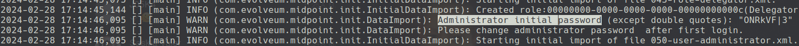

# midPointEcosystem
Este repositorio incluye la construcción del IDM MidPoint integrado a una base de datos y un servidor LDAP.

## Administrator Initial Password
A continuación se detallan los pasos para obtener la contraseña inicial del administrador:

1. **Ingresar al Docker de MidPoint:**
    ```bash
    docker exec -it 749e05c56d24 /bin/bash
    ```
2. **Abrir el archivo `midpoint.log`:**
    ```bash
    nano /opt/midpoint/var/log/midpoint.log
    ```
3. **Buscar la línea que contiene "Administrator initial password":**
    
4. **Obtener la contraseña inicial:**
    - Administrator initial password (except double quotes): **"ONRkVF|3"**
